[comment]: # (Warm-up - Why are we presenting?)
### We are software engineers
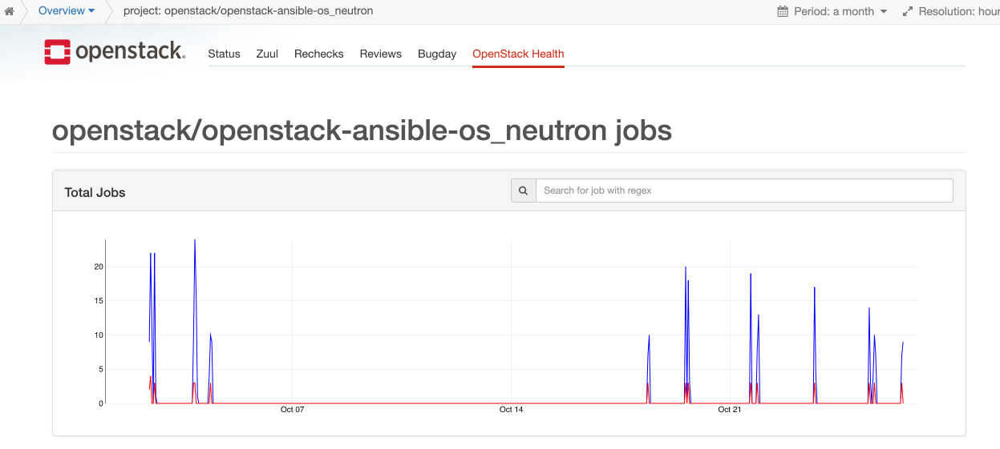

Note:
- Tristan is working at Red Hat, member of the OpenStack Vulnerability Management Team for more than 3 years, working on CI/CD solution
- Dirk is working at SUSE and spending too much time looking at log files :)


### We love ~~YouTube~~ OpenStack Health


### We watch OpenStack Health
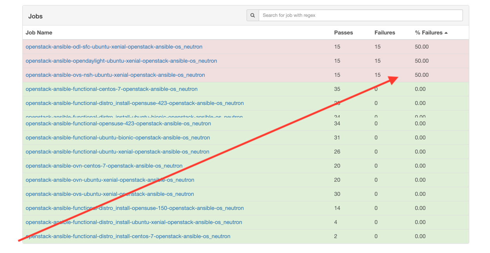


### Let's peek the log...
<!-- .slide: data-background-image="images/job-log-output-zoom-out.png" -->

Note:
- Here we see about 2% of the logfile of the OpenStack Infra
job http://logs.openstack.org/86/613286/1/check/openstack-ansible-opendaylight-ubuntu-xenial/616f532/job-output.txt.gz
- There is an error in there, can you see it?


# ?
<!-- .slide: data-background-image="images/job-log-output-zoom-out.png" -->


### Found it?
<!-- .slide: data-background-image="images/job-log-output-zoom-out.png" -->


## Current Process
<!-- .slide: data-background-image="images/job-log-output-zoom-out.png" -->
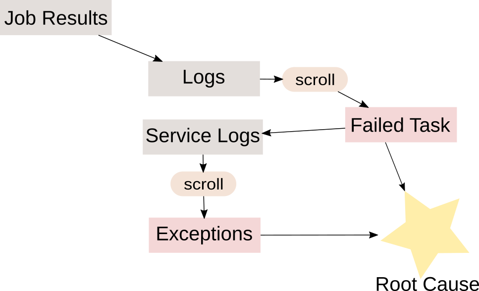

Note:
- This diagram shows the current actions a developper usually does to
  understand why a job failed.
- This process is tedious and time consuming and usually involves lots
  of clicking and scrolling...


## What if the machine looked for the errors?


Note:
- Most of this process can be automated.
- Automatic anomaly detection may greatly reduces investigation time.


### Log-Classify
<!-- .slide: data-background-image="images/job-log-output-zoom-out.png" -->
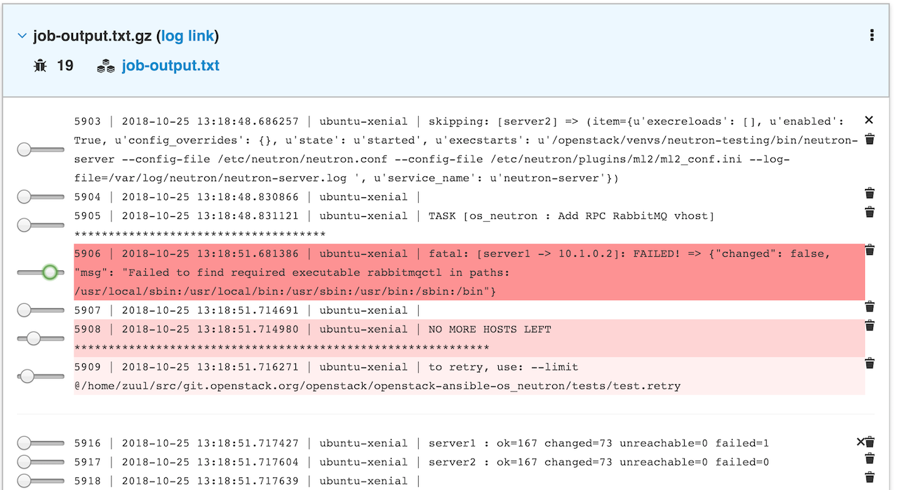


## Today's plan<!-- .element: style="color: white; background-color:rgba(0, 0, 0, 0.6)" -->
<!-- .slide: data-background-image="images/berlin.jpg" -->

Short intro to Machine Learning <!-- .element: style="color: white; background-color:rgba(0, 0, 0, 0.6)" -->

Tool presentation <!-- .element: style="color: white; background-color:rgba(0, 0, 0, 0.6)" -->

CI logs classification <!-- .element: style="color: white; background-color:rgba(0, 0, 0, 0.6)" -->


## Taxonomy
- ai/ml
- models
- baselines, targets


### Using machine learning to remove noise

Note:
- This section introduces two objects that can be used with CI logs:
  - the HashingVectorizer processor; and
  - the NearestNeighbor model.
- Note that other models may easily be used while keeping the same
  generic workflow.


### Generic Training Workflow
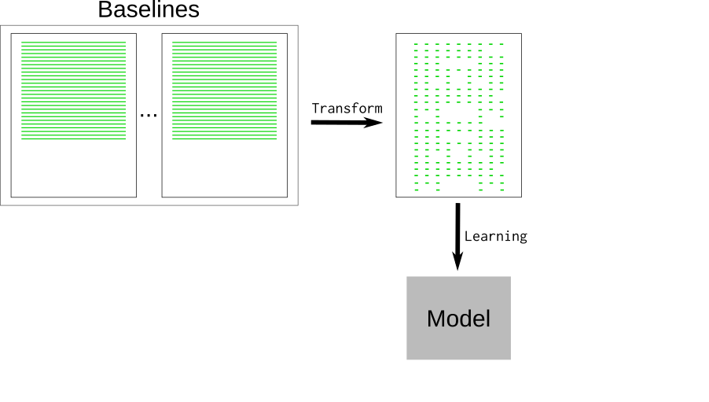

Note:
- This diagram shows how baselines are processed to train a model.
- The raw text lines need to be converted before being used by a machine learning model.


### Generic Testing Workflow
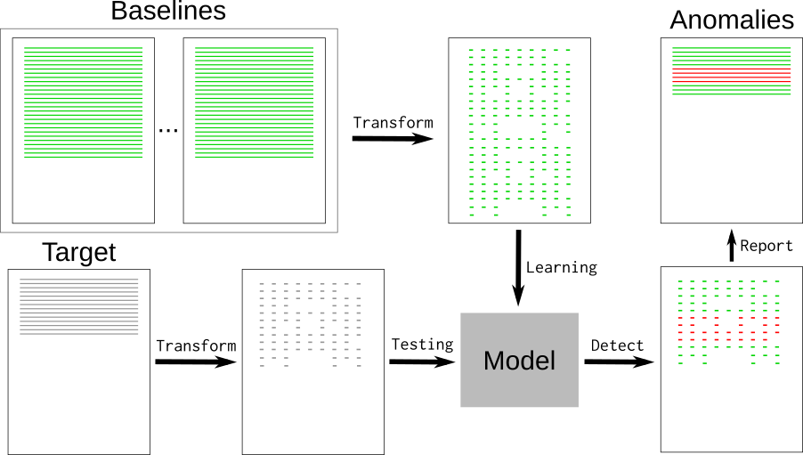

Note:
 - After the model is trained, we can repeat the same process to test
    the target and extract the novelties.


## Hashing Vectorizer
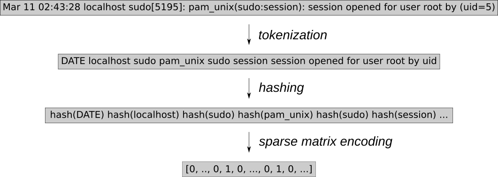

Note:
- The first step of the workflow is to transform raw log lines into
something more convenient for machines.
- The raw data can't be used because it's noisy: it contains random parts
that would yield false positives.
- Let's use simple tokenization and a hashing vectorizer to transform
the data.
- The sparse matrix is a numeric array of all possible hashes
(2**20 by default).
- Each vector is very sparse as it only contains the token hashes.


## Noise Reduction
- Random words may be replaced with known tokens:

<table><tr><th>Token</th><th>Raw text</th>
<tr><td><pre>DATE</pre></td><td>months/days/date</td></tr>
<tr><td><pre>RNGU</pre></td><td>uuid</td></tr>
<tr><td><pre>RNGI</pre></td><td>uuid</td></tr>
<tr><td><pre>RNGN</pre></td><td>uuid</td></tr>
<tr><td><pre>&quot;&quot;</pre></td><td>all numbers and non letters</td></tr>
</table>


## Example of Devstack Vectors
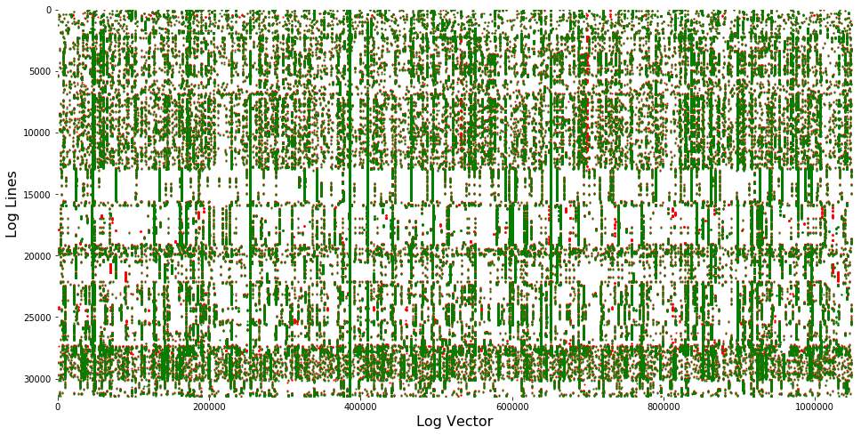

Note:
- This example shows the vectors of a devstack job-output of 34k lines.
- The green dots show baseline vectors.
- The red dots show target vectors.
- This representation shows all the vectors in order, though we will
look for the distances of each target vector to any baseline vectors.
- We can use a learning model to detect the red dots.


## Nearest Neighbors Unsupervised Learner
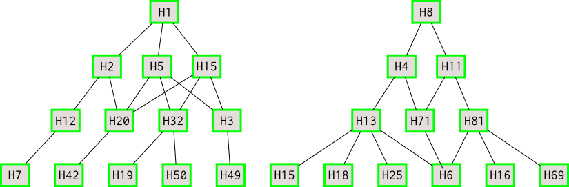

Note:
- Nearest Neighbors learns from baseline vectors.
- This builds a tree of connected tokens.
- This doesn't hold the whole dataset.


## kNeighbors computes vector's distance
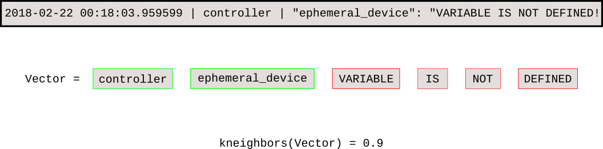

Note:
- This example illustrates an anomaly from the previous devstack example.
- The Nearest Neighbors model quickly computes the distance of a new
vector to the baseline.


## Caveats
- Need DEBUG in baseline logs.
- Noise may hide important information:
```
    pcre enabled            | pcre disabled
    setup mirror hostnameA  | setup mirror hostnameB  |  
```
- Tokenization may need adjustment for small dataset.

Note:
- This method relies on the fact that the baseline contains all
  non-anomalous data. Anything that can't be found in the baseline will be
  reported as anomalous.
- For example, /testr/ logs only contains 'SUCCESS' when they succeed, and
  all the logs are only emited when the job fails.
- The example shows that both lines have the same distance, though we are only
  interested in the "pcre disabled" one.

- The next section introduces the log-classify tool, an implementation of this
  method.


## Introducing log-classify

- CLI that implements above process
- Command line published on pypi
```bash
    $ pip3 install --user logreduce
```
- Output /distance/ | /filename:line-number/: **anomaly**
- Multiple baselines can be used


## Managing baseline
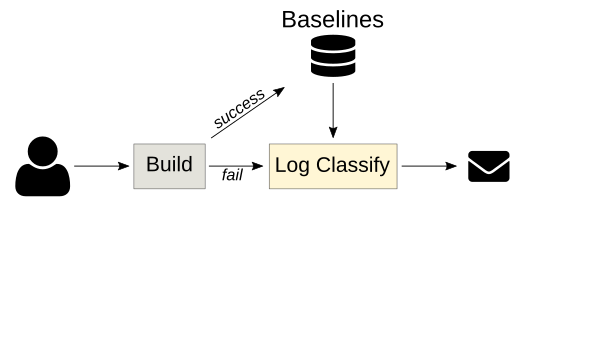

Note:
- The key to using k-NN regression for anomaly detection is to have a database of known good baselines.


# Journald
- Extract novelty from the last day:
```bash
    $ logreduce journal --range day
```
- Build a model using last month's logs and look for novelties in the last week:

```bash-
    $ logreduce journal-run   --range week  journald.clf
```

Note:
    - The journald range sets baseline as the previous day/week/month and the
      target as the current day/week/month.
    **** DEMO: generate some syslog events (e.g. run logger, kill a service, ...),
           show that looking at journalctl is boring,
           then using a pre-trained model, extract the new events


## Sos Report
```bash
$ logreduce --debug diff report-good/ report-bad/ \
            --html report.html
INFO  Classifier - Training took 84.141 seconds to ingest 33.458 MB
INFO  Classifier - Testing took 173.464 seconds to test 22.952 MB
99.67% reduction (from 128882 lines to 424)
```

Note:
- A model is built per file. The model name is a minified version of the
  filename to include variations, e.g. audit.1 and audit.2 use
  the same model.
- "Loading" and "Testing" debug shows the /model-name/: used for each file.
- Before printing the anomalies, the baseline sources are also displayed,
  see the /compared with/ debug.
**** DEMO: open a pre-generated html report and show non obvious issue that are
        detected


## Web Frontend
- React interface for anomaly classification

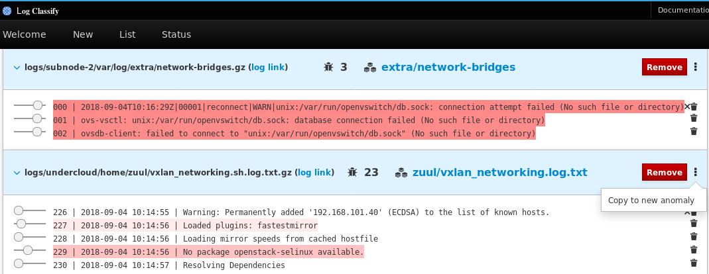
- Need further development <!-- .element: class="fragment" data-fragment-index="1" -->

Note:
- The server and web frontend only support Zuul Build at the moment.


# (Zuul) CI Workflow

Note:
- Using the tool manually may be cumbersome.
- We will now see different ways to integrate anomaly detection
  in a CI workflow.


## Build results
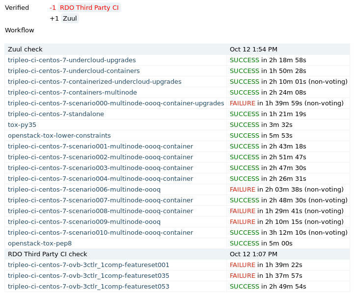

Note:
- CI jobs are great targets for k-NN regression because the job outputs are
  often deterministic and previous runs can be automatically used as baselines.


## Zuul Architecture


Note:
- This diagram shows the basic zuul workflow.
- Jobs are executed on ephemeral test instances.
- The executor retrieves the logs and publishes them to a logserver.
- Zuul returns the logserver url to the user.
- Zuul stores build information in a database. This is the key component
  to make the log-classify process possible.


## Post-Run Analysis
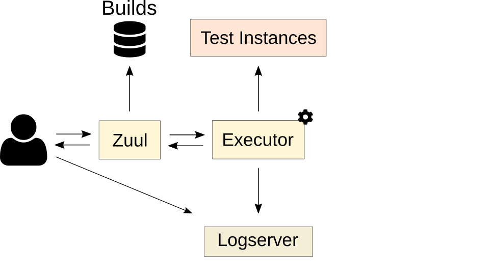

Note:
- This diagram shows the log-classify process running on the executor node.
- Pros: users/job doesn't have to be adapted, the post-run can be added to the base job.
- Cons: memory/cpu overhead on shared resources.


## Post-Run Playbook
```yaml
    - job:
        name: base
        post-run:
          - upload-log
          - clasify-log
```
```yaml
    - tasks:
      - name: Fetch or build the model
        command: log-classify job-build ...
      - name: Generate report
        command: log-classify job-run ...
      - name: Return report url
        zuul_return: {zuul: url: log: ...}
```


## Logstash Filter
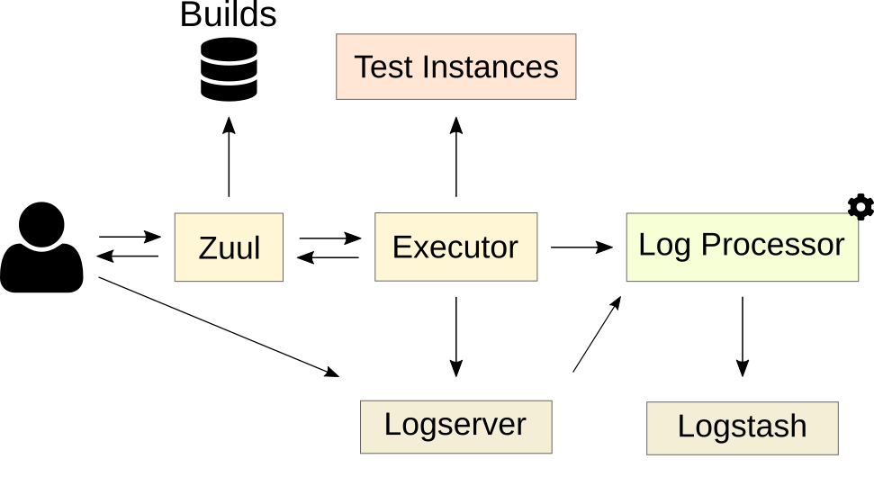

Note:    
- This diagram shows a more advanced Zuul workflow including a log-processor.
- The log-classify could be used as a library to add distance values to logstash events.
- Cons: the users need to wait and go to Kibana to get the report.


## Standalone Service
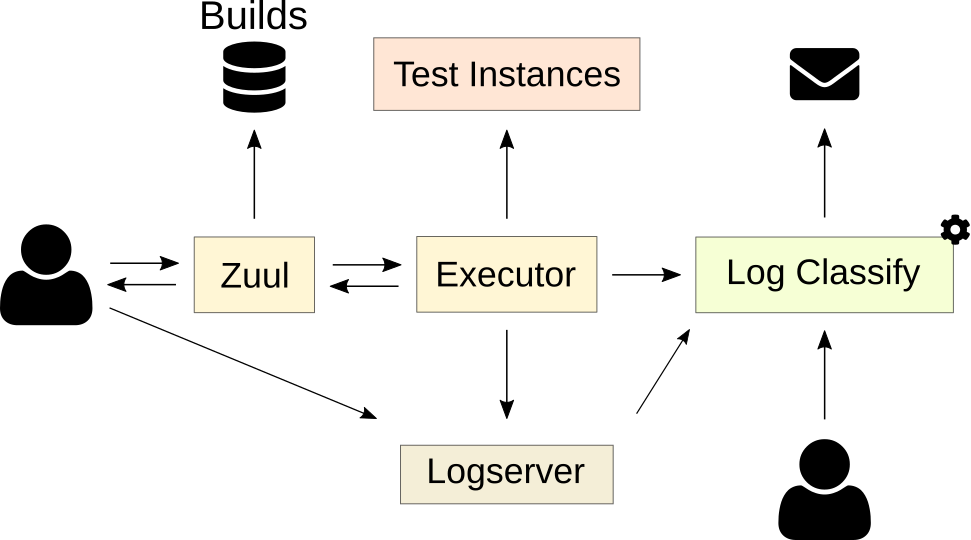

Note:
- The log-processor could be adapted as a standalone service (TBD).
- Could interface with elastic-recheck.
- This would enable user interaction, for example:
  - Trigger manual analysis
  - Feedback false-positive
  - ...
DEMO:
- Grab a failed job from zuul.openstack.org, put the uuid in the new form
  and show the interface
**** TODO: record a backup video for this demo


## www.softwarefactory-project.io
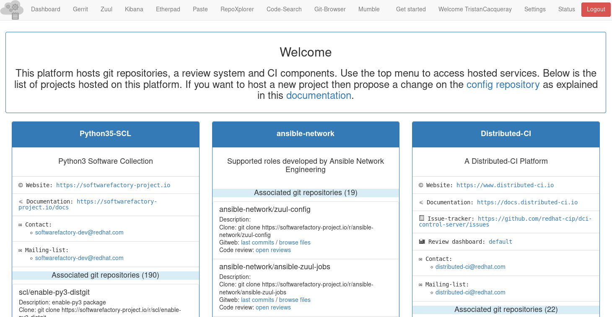

Note:
- Logreduce has been created in the context of Software Factory.
- It is an OpenSource development forge that integrates many component to
  be easily deployed on premise or as a service.
- The architecture is modular and the screenshot shows some of
  the ready-to-use components.
- Logreduce is integrated as part of the default CI logs processing.


# Conclusion


## Roadmap
- Curate public domain dataset
- Fingerprint archived anomalies
- Support more services: Jenkins build, Travis CI

Note:
- A public domain dataset to enable further research in that field.
  Having a common dataset to test new models would help find new solutions.
- Detect known "fingerprint" similarly to the elastic-recheck.
- Support more services to discover baselines


## Q&A

Note:
    - And this concludes the presentation.
    - Thank you for your time!


## Credits
Icons used in diagrams are licensed under Creative Commons Attribution 3.0: https://fontawesome.com/license
