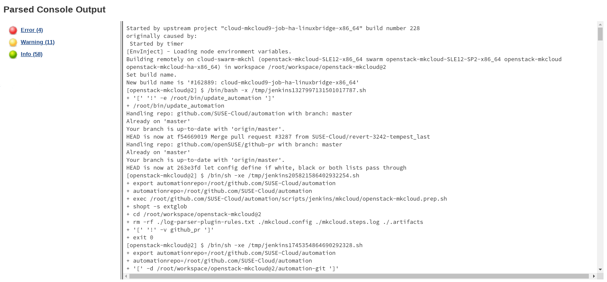
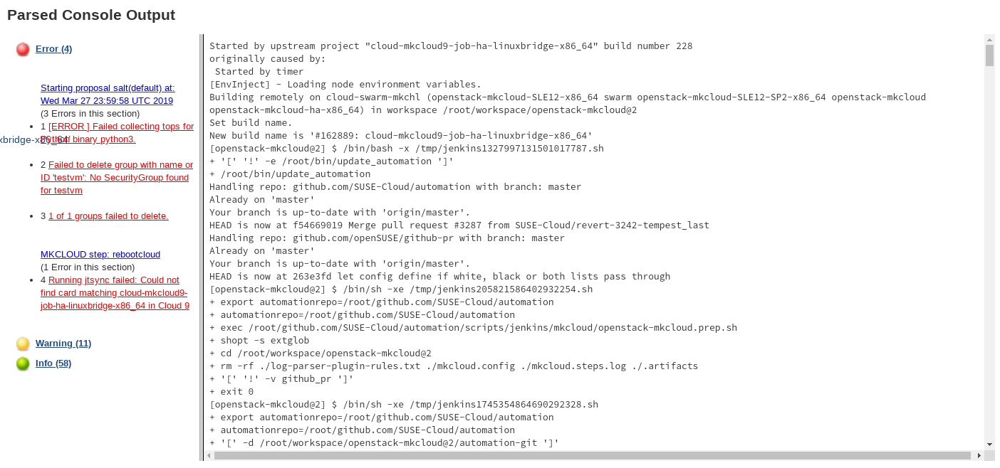
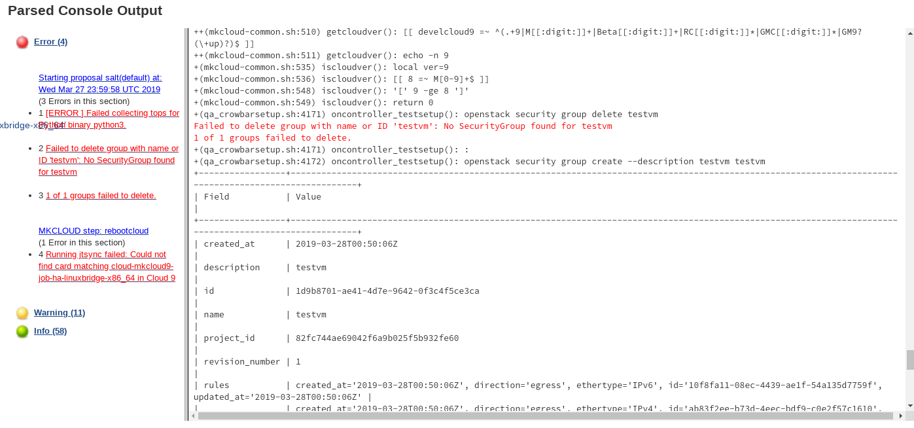

[comment]: # (Warm-up - Why are we presenting?)
### We are cloud engineers


Note:
- We've both been troubleshooting SUSE OpenStack Cloud since the early days
  and spend too much time looking at log files :)


<!-- .slide: data-state="normal" data-menu-title="Green CI" -->
### We love green CI


Note:
- OpenStack runs a huge CI system for supporting the software development
- It produces tremendous amount of results and data
- OpenStack Health gives you a good way to introspect testing results
- This graph from OpenStack Health shows that each project undergoes
  many runs daily


<!-- .slide: data-state="normal" data-menu-title="SOC CI" -->
### We watch SUSE OpenStack Cloud CI


Note:
- Sometimes jobs fail unexpectedly


<!-- .slide: data-state="normal" data-menu-title="OpenStack Health" -->
### We watch OpenStack Health


<!-- .slide: data-background-image="images/job-log-output-zoom-out.png" data-menu-title="Find the error" -->
# ?

Note:
- Here we see that about 2% of the OpenStack Infra job log
  http://logs.openstack.org/86/613286/1/check/openstack-ansible-opendaylight-ubuntu-xenial/616f532/job-output.txt.gz
- Ask audience if they are looking at those log files regularly?
- There is an error in there, can you see it?


### Did you find it?
<!-- .slide: data-background-image="images/job-log-output-zoom-out.png" -->


<!-- .slide: data-state="normal" -->
### Manual Process


Note:
- This diagram shows the current actions a developer usually does to
  understand why a job failed
- This process is tedious and time consuming and usually involves lots
  of clicking and scrolling...
- Sometimes the root cause is not labelled with an easy to grep for error
  message


### Reducing scrolling by pattern matching

```perl
warning /(?i)warning/

error /Traceback \(most recent call last\)/
error /(?i)error/
error /(?i)\bfail(ure|ed)?\b/
error /(?i)fatal/
error /$h1!!/
```


<!-- .slide: data-state="blank-slide" class="full-screen" data-menu-title="Log parser 1" -->
<div></div>


<!-- .slide: data-state="blank-slide" class="full-screen" data-menu-title="Log parser 2" -->
<div></div>


<!-- .slide: data-state="blank-slide" class="full-screen" data-menu-title="Log parser 3" -->
<div></div>


### Dealing with false positives

```perl
# Successful tempest run
ok /^ - (Expected Fail|Failed): 0$/
ok /Warning: Turning on '--gpg-auto-import-keys'/
ok /Warning: Permanently added .* to the list of known hosts/
ok /WARNING: Device for PV .* not found or rejected by a filter/
ok /WARNING: \w+ signature detected on .* offset \d+. Wipe it?/
ok /grep -v failed\b/

# rpms containing "Error"
ok /perl-Error[ -]|libsamba-errors|mariadb-errormessages/

# https://bugzilla.suse.com/show_bug.cgi?id=1030822
warning /Cleaning up (vip-admin-\S+) on \S+, removing fail-count-\1/

# https://bugzilla.suse.com/show_bug.cgi?id=971832
ok /Failed to try-restart vsftpd@.service: Unit name vsftpd@.service is not valid/
```

Note:
https://github.com/SUSE-Cloud/automation/blob/master/scripts/jenkins/log-parser/openstack-mkcloud-rules.txt


### Vision: Machine Learning


Note:
- We believe large parts of this process can be automated
- When there are non-obvious causes like race condition or features
  being enabled/disabled an automatic process can be more precise in
  isolating that
- This tooling for supporting you on anomaly detection may greatly
   reduce investigation time


### Log-Classify


Note:
- To give you a preview, we'll introduce you to concepts and tooling
  that will help you to switch from a long boring log file to
  a condensided annotated report that highlights the anomalies to
  look for.


## Today's plan<!-- .element: style="color: white; background-color:rgba(0, 0, 0, 0.6)" -->
<!-- .slide: data-background-image="images/nashville.jpg" -->

Intro to Machine Learning <!-- .element: style="color: white; background-color:rgba(0, 0, 0, 0.6)" -->

Log-Classify Implementation <!-- .element: style="color: white; background-color:rgba(0, 0, 0, 0.6)" -->

CI Integration Demo <!-- .element: style="color: white; background-color:rgba(0, 0, 0, 0.6)" -->


<!-- .slide: data-menu-title="AI vs. ML vs. DL" -->
### &nbsp;


Note:
- AI is about machines mimicing human intelligent behaviour
- ML is the subset of AI that uses statistical methods to extract rules from data
- Deep Learning is a subset of ML that most often uses multiple layers of
  an artificial neural networks for modelling machine learning methods
- Big Data transition to machine learning
- ML is a field of artificial intelligence that uses statistical techniques.
- And Nearest Neighbors is one of the simplest of all ML algorithms that we will explore today.
- In this presentation:
  - Build defines generic process that generates logs, e.g. CI jobs,
      deployment scripts, service operations, ...
    - Baseline defines nominal build
    - Target defines build that we want to analyze.
- Deep Learning (neural network modelling) is an example of generalizing learning
- Nearest Neighboars is an instance based learning algorithm


### Why Machine Learning?


Note:
- By using statistical methods over larger sets of data,
  patterns can be extracted by following statistical approaches
- In this example we see a word cloud of the english wikipedia
  article about machine learning. Without understanding the
  structure of the article or english language, we can naturally
  infer that the article was indeed about machine learning.


<!-- .slide: data-state="normal" -->
### CI Logfiles: ML Challenges

- Each Instance of a CI Logfile execute the same steps
  - Install, Build, Test &#x1F642;
  - Result is recorded (success, failures)
- The individual Logfiles are quickly evolving
  - Every check-in changes it &#x1F610;
- Each run has a lot of completely unique noise &#x1F612;
  - Timestamps, UUIDs, Passwords and
  - ordering due to parallel execution


<!-- .slide: data-state="normal" -->
### Learning techniques

<table>
<thead><tr>
<th width="50%">Instance-based</th>
<th width="50%">Generalizing</th>
</tr></thead>
<tbody><tr>
<td><small>
- Directly store instances of training<br/>
- Derives hypotheses directly from training instances<br/>
- Model can be quickly react to new training input<br/>
- Model can be incrementally updated discarding old training input<br/>
<p>
<b>k-Nearest-Neighbor</b>
</p>
</small>
</td><td><small>
- Abstracting a model from training data<br/>
- Requires longer training phase<br/>
- Can not "untrain" previously learned data<br/>
<p>
<b>Artifical Neural Networks (DL)</b>
</p>
</small></td></tr>
</tbody>
</table>


<!-- .slide: data-state="normal" -->
### Overfitting / Underfitting


<!-- .slide: data-state="normal" -->
### Machine Learning Variations

<table>
<thead><tr>
<th width="50%">Supervised</th>
<th width="50%">Unsupervised</th>
</tr></thead>
<tbody><tr>
<td><small>
<b>
Classification<br/>
</b>
Naive Bayes<br/>
<u>NearestNeighbor</u><br/>
Support Vector Machines (SVM)<br/>
Neural Networks ...
<br/>
<br/>
<b>Regression<br/></b>
Decision Trees<br/>
Linear Regression<br/>
Neural Networks ...
</small>
</td><td><small>
<b>
Clustering<br/>
</b>
K-Means<br/>
Hidden Markov Model<br/>
Neural Networks ...
</small></td></tr>
</tbody>
</table>


<!-- .slide: data-state="normal" -->
### Supervised Learning: Classification

<table>
<tr><td>

</td>
<td style="vertical-align: middle">
&nbsp;&nbsp;&nbsp;&nbsp;&nbsp;&nbsp;
</td>
<td style="vertical-align: middle">
<div style="padding: 15px; background-color: #6a6; box-shadow: 4px 5px 5px 0px rgba(0,0,0,0.75);">Banana</div>
</td>
<td style="vertical-align: middle">

</td>
<td style="vertical-align: middle;">

</td>
</tr>

<tr>
<td style="vertical-align: middle">

</td>
<td style="vertical-align: middle">

</td>
<td style="vertical-align: middle">
&nbsp;&nbsp;&nbsp;&nbsp;&nbsp;&nbsp;
</td>
<td style="vertical-align: middle;">
<div style="padding: 15px; background-color: #6a6; box-shadow: 4px 5px 5px 0px rgba(0,0,0,0.75);">Banana</div>
</td>
</tr>
</table>


<!-- .slide: data-state="normal" -->
### Regression vs Classification

- Regression: Predict a continuous quantity
    - "What is the price of this used car?"
- Classification: Which label(s) apply to this input?
    - "Is this a flower, tree or a horse?"


<!-- .slide: data-state="blank" -->
### Using machine learning to remove noise


Note:
- This section introduces the base principle along with
  two objects that can be used with logs:
  - the HashingVectorizer processor; and
  - the NearestNeighbor model
- Note that other models may easily be used while keeping the same
  workflow.


<!-- .slide: data-state="normal" -->
### Machine Learning Workflow
- **Build**: an individual CI log file
- **Baseline**: Collection of log files from good CI runs
- **Target**: The to be analyzed failed CI log run logfile


<!-- .slide: data-state="normal" -->
### Generic Training Workflow
 <!-- .element: class="fragment plain" data-fragment-index="1" -->

Note:
- This diagram shows how baselines are processed to train a model
- The raw text lines need to be converted before being used by a
  machine learning model


<!-- .slide: data-state="normal" -->
### Generic Testing Workflow
<!-- .slide: data-transition="none" data-background-transition="none" -->


Note:
- We can repeat the same process to test the target


<!-- .slide: data-state="normal" -->
### Generic Testing Workflow
<!-- .slide: data-transition="none" data-background-transition="none" -->


Note:
- After the model has been trained with nominal data, it can detect the noise
  from the target data and report what went wrong
- Next we will see how to implement such model


<!-- .slide: data-state="normal" -->
### Input transformation steps

Splitting by lines
<pre style="font-size: 10pt; font-weight: bold">
Mar 11 02:43:28 localhost sudo[5195]: pam_unix(sudo:session): session opened for user root by (uid=5)
</pre>
Tokenization
<pre style="font-size: 10pt; font-weight: bold">
DATE localhost sudo pam_unix sudo session session opened for user root uid
</pre>
Hashing
<pre style="font-size: 10pt; font-weight: bold">
hash(DATE) hash(localhost) hash(sudo) hash(pam_unix) hash(sudo) hash(session) hash(opened) ...
</pre>
Transformation
<pre style="font-size: 10pt; font-weight: bold">
[0, ...., 0, 1, 0, ..., 0, 1, 0, ...]
</pre>

Note:
- After tokenization, log lines needs to be transformed into
  something more convenient for machines.
- The Hashing Vectorizer convert each words into a numeric hash value using a
  hashing trick.
- Then it encodes the token occurence information into a
  sparse matrix array of all the possible hashes
  (1 million by default).
- Each vector is very sparse as it only contains the token hashes
- The vectorizer is used on each log lines, whatever its source or structure.


<!-- .slide: data-state="normal" -->
### Input transformation: Noise reduction
<table><tr><th>Token</th><th>Raw text</th>
<tr><td><b><pre>DATE</pre></b></td><td>months/days/date</td></tr>
<tr><td><b><pre>RNGU</pre></b></td><td>UUIDs</td></tr>
<tr><td><b><pre>RNGI</pre></b></td><td>IPv4 or IPv6 addresses</td></tr>
<tr><td><b><pre>RNGN</pre></b></td><td>words that are exactly 32, 64 or 128 chars</td></tr>
<tr><td><b><pre>RNGD</pre></b></td><td>numbers of at least 3 digits</td></tr>
</table>

Note:
- We already know what is not relevant for log analysis
- Random words may be replaced with known tokens
- Generic tokenization greatly reduce the complexity


<!-- .slide: data-state="normal" -->
### Example matrix of a CI logfile


Note:
- This example shows the vectors of a devstack job-output of 34k lines
- The green dots show baseline vectors
- The red dots show target vectors
- This representation shows all the vectors in order, though we will
look for the distances of each target vector to any baseline vectors
- Next we will see how to interpret those vectors


<!-- .slide: data-state="normal" -->
### Nearest Neighbors


Note:
- Nearest Neighbors learns from baseline vectors
- It enables efficient regression analysis that can
  be used to quickly compute the distance of targets
  vectors to the baselines


<!-- .slide: data-state="normal" -->
### kNeighbors queries


Note:
- This example illustrates a knn search from the previous devstack example.
- In this case the line contains unknown tokens showed in red
  which increase the distance a lot.


<!-- .slide: data-state="normal" -->
### Limitations
- Nearest Neighbor uses brute force search     <!-- .element: class="fragment" data-fragment-index="1" -->
- Complexity grows linearly with samples size  <!-- .element: class="fragment" data-fragment-index="2" -->
- Noise may hide important information         <!-- .element: class="fragment" data-fragment-index="3" -->
- Logs may contain many features               <!-- .element: class="fragment" data-fragment-index="4" -->

Note:
- Preliminary work based on the HashingVectorizer. It works well for
  a large majority of log files.
- The current Nearest Neighbor implementation actually uses a
  brute force search for sparse matric vectors:
  http://scikit-learn.org/stable/modules/neighbors.html#nearest-neighbor-algorithms
- Which means that search complexity grows linearly with samples size
- Because it is an unsupervised learning model, short failure message
  may be indeferent from noise.
- NN doesn't work well if logfile contains too many
  sparse features. Mistral logs, i'm looking at you :)


<!-- .slide: data-state="normal" -->
### Unique vectors over training set instances


Note:
- Most log files have a limited amount of possible variations.
- This graph shows the number of unique vectors found in
  tempest-full job-output.


<!-- .slide: data-state="normal" -->
### Lookup time per sample size


Note:
- This graph shows search time growing linearly with sample sizes.
- Samples sizes above 1 millions vectors aren't practical, it
  would takes 40ms to compute one distance, so about 10 minutes to
  process a typical tempest-full job-output.
- The next section introduces an easy-to-use implementation of this technique.


## Introducing log-classify


<!-- .slide: data-state="normal" -->
### Log-classify
- Uses http://scikit-learn.org/ 

- Python 3 &#x1F642;
- Multiple Text Extraction Models
- Assumes text, line based log-like input

Note:
- scikit-learn is a framework for using Machine Learning with Python
- Provides a set of algorithms for efficient data analysis
- For Text based learning, it provides various like
  for example the Bag-of-Words approach or the HashingVectorizer
- Provides TfidfVectorizer and HashingVectorizer based k-NNeighbor model
- in our experience the HashingVectorizer works best for logfiles


<!-- .slide: data-state="normal" -->
## scikit-learn
<p style="text-align: center">

</p>


<!-- .slide: data-state="normal" -->
### log-classify: Installation

openSUSE Leap/Tumbleweed:

```shell
    $ zypper install python3-logreduce
```

Others install from PyPI:

```shell
    $ pip3 install --user logreduce
 ```

Note:
- Can be installed with pip or from distribution provided packages


<!-- .slide: data-state="normal" -->
### log-classify: Commands

<small>
```shell
# logreduce
...
    diff                Compare directories/files
    dir                 Train and run against local files/dirs
    dir-train           Build a model for local files/dirs
    dir-run             Run a model against local files/dirs
...
    job                 Train and run against CI logs
...
    journal             Train and run against local journald
```
</small>

Note:
- logreduce can be used based on local files or set of files in directories
- Also provides integration with Zuul CI jobs or systemd journal
- Each command also has a -train and -run command for more control
  over baseline/target management


<!-- .slide: data-state="normal" -->
### log-classify: Assumptions

- Baseline is built from **SUCCESS** input
- Model is run against **FAILURE** target

Note:
- Instance based, or non-generalizing training
- Training only successful runs detects auto-collecting of logs after failure
- Uses statistical k-NN which is compareable to Bayes


<!-- .slide: data-state="normal" -->
### log-classify: Image Metaphor


Note:
- Can you see a difference?
- Humans are good at spotting the one obvious deviation,
  machines can extract all the differences that were less
  obvious to see.


<!-- .slide: data-state="normal" -->
### log-classify: DevStack

```shell
# logreduce diff logs/good.txt logs/bad.txt
...
0.527 | bad.txt:34245:  2018-10-09 05:56:51.021261 | controller |\
     Details: {u'created': u'2018-10-09T05:11:20Z', u'code': 500,\
     u'message': u'Exceeded maximum number of retries. Exhausted \
     all hosts available for retrying build failures for instance
     d7046aa3-e885-4ed6-80e7-d7a7eff9f883.'}
...
97.98% reduction (from 35244 lines to 712)
```

Note:
- Diff can be used quickly to fuzzy compare two logfiles
- Will build a temporary model in memory
- Even a single baseline sample produces a reasonable result
- Dimensions are # lines / # hashing size


<!-- .slide: data-state="normal" -->
### log-classify: DevStack Model
<p style="text-align: center">

<small>Truncated singular value decomposition (SVD)</small>
</p>

Note:
- SVD reduces the million dimensions to a human graspable
  scatter plot of 2D graphics
- Grey shows the raw words in the devstack stream
- Red shows the normalized tokens from logreduce
- log-classify will reduce the noise and hence the
  features to consider for the training process


<!-- .slide: data-state="normal" -->
### log-classify: Collecting baselines

```shell
$ logreduce dir-train model.clf baseline/*
Training on 8 logs took 12.090s at 1.426MB/s (20.831kl/s)

$ logreduce dir-run model.clf error.txt

Testing took 6.375s at 0.454MB/s (6.569kl/s)
99.72% reduction (from 41879 lines to 118)
```

Note:
- Two phases: Training and then extraction
- Key question: How large should be the baseline?


<!-- .slide: data-state="normal" -->
### log-classify: Training Set Size


Note:
- It depends on particular logfile structure
- Influence of training size on the output result size
- Even a baseline from a single sample is leads to reduction from the
  raw 35000 logs
- 4-8 samples seems to be a good training set size for getting good results


<!-- .slide: data-state="normal" -->
### log-classify: Journald
- Extract novelty in todays logs over yesterday:

```shell
# logreduce journal --range day
```
- Build a model using previous month's logs and look for novelties:

```shell
# logreduce journal-train --range month journal.clf
```

Note:
- The journald range sets the baseline as the previous day/week/month and
  the target as the current day/week/month


<!-- .slide: data-state="normal" -->
### log-classify: journald (II)

```shell
# logreduce journal-run --range day journal.clf
...
99.76% reduction (from 19677 lines to 48)

0.730 | cron - postdrop: warning: uid=16311: File too large
...
0.000 | smartd Device: /dev/sdb, 1 Offline uncorrectable sectors

# killall -SEGV automount
# logreduce journal-run --range day journal.clf
99.75% reduction (from 19679 lines to 50)
...
0.317 | systemd - DAEMON - autofs.service: Main process exited, code=dumped, status=11/SEGV
0.314 | systemd - DAEMON - autofs.service: Failed with result 'core-dump'.
```

Note:
- We can see a new anomaly in my journal related to postfix not able to
  store email anymore
- We also see that one of the drives has a bad sector, but anomaly rating zero!
- Producing an anomaly and rerunning shows the new anomaly immediately


<!-- .slide: data-state="normal" -->
### Supportconfig
```shell
# logreduce diff report-good/ report-bad/ --html report.html
Training took 51.364s at 1.543MB/s
Testing took 37.432s at 0.446MB/s
...
88.41% reduction (from 261091 lines to 30251)
```
 <!-- .element: class="fragment" data-fragment-index="1" -->
 <!-- .element: class="fragment" data-fragment-index="2" -->

Note:
- A model is built per file. The model name is a minified version of the
  filename to include variations, e.g. audit.1 and audit.2 use
  the same model
- A model allows blending out "typical" errors from atypical ones
- "Loading" and "Testing" debug shows the /model-name/: used for each file
- HTML output is better for handling large outputs
- Work in progress


<!-- .slide: data-state="normal" -->
### log-classify: OpenStack log files

```shell

# logreduce dir-train nova.clf /var/log/nova/nova-compute.log-*xz
# logreduce dir-run nova.clf /var/log/nova/nova-compute.log
...
0.684 | INFO .. No calling threads waiting for msg_id : d3afd41a53bb4d14a5e42da0e522f700
0.619 | INFO .. Recovered from being unable to report status
...
93.15% reduction (from 6741 lines to 462)
```

Note:
- Similarly log-classify can be used to analyze for anomalies as
  part of local logrotate if you use decentralized logging.
- Needs more work for integration with centralized logging systems.


<!-- .slide: data-state="blank" -->
## CI Workflow

Note:
- Using the tool manually may be cumbersome
- We will now see different ways to integrate anomaly detection
  in a CI workflow


<!-- .slide: data-state="normal" -->
### Build results


Note:
- At the end of run, the user is presented with a list of build result,
  and the goal is to help him understand why a build failed.
- CI jobs are great targets for k-NN regression because the build outputs are
  often deterministic and previous runs can be automatically used as baselines


<!-- .slide: data-state="normal" -->
### Zuul Architecture


Note:
- This diagram shows that users interact with the Zuul Scheduler through
  code review systems.
- The scheduler executes builds through a remote executor service.


<!-- .slide: data-state="normal" -->
### Zuul Architecture 2
<!-- .slide: data-transition="none" data-background-transition="none" -->


Note:
- Builds are executed on ephemeral test instances
- The executor retrieves the logs and publishes them to a logserver


<!-- .slide: data-state="normal" -->
### Zuul Architecture
<!-- .slide: data-transition="none" data-background-transition="none" -->


Note:
- Zuul returns the logserver url to the user
- Zuul stores build information in a database. This is the key component
  to make the log-classify process automatic for CI logs.

- This diagram shows the basic zuul workflow, let's see how log-classify
  can be used.


<!-- .slide: data-state="normal" -->
### Post-Run Analysis
<!-- .slide: data-transition="none" data-background-transition="none" -->


Note:
- This diagram shows the log-classify process running on the executor node
- Pros: jobs don't have to be adapted, the post-run can be added to the base job
- Cons: memory/cpu overhead on shared resources


<!-- .slide: data-state="normal" -->
### Post-Run Playbook
```yaml
    - job:
        name: base
        post-run:
          - classify-log
          - upload-log
```
```yaml
    - tasks:
      - name: Fetch or build the model
        command: log-classify job-train ...
      - name: Generate report
        command: log-classify job-run ...
      - name: Return report url
        zuul_return: report.html
```

Note:
- This is an example of base job integration
- Log-classify comes with zuul-jobs roles ready to be used to report
  the job's condensed summary to the user.


<!-- .slide: data-state="normal" -->
### Standalone Service


Note:
- Log-classify can be deployed as a service to run analysis
  after the build execution.
- Trigger could be automatic after log upload, or requested
  manually.
- Pros: enable user interaction, for example,
  feedback false-positive, centralized index of anomalies, ...
- Cons: asynchronous, builds result still points at
  directory index of raw files.


<!-- .slide: data-state="normal" -->
### Demo
<video id="demovideo" class="stretch"><source data-src="videos/short.webm" type="video/webm" /></video>

Note:
- Grab a failed build from zuul.openstack.org, put the uuid in the new form
  and show the report interface
- Or fallback to recorded demo


<!-- .slide: data-state="section-break" -->
## Conclusions


<!-- .slide: data-state="normal" -->
### Software Factory

Log-Classify is hosted on softwarefactory-project.io


Note:
- Log-classify has been created in the context of Software Factory.
  It is an OpenSource development forge that integrates many component to
  be easily deployed on premise or as a service.
  The architecture is modular and the screenshot shows some of
  the ready-to-use components
- Log-classify is integrated as part of the default CI logs processing


<!-- .slide: data-state="normal" -->
### How to contribute
- Apache-2.0 Licensed
- #log-classify on Freenode

Note:
- Join us on #log-classify IRC channel on Freenode to get involved


<!-- .slide: data-state="normal" -->
### Future plans
- Handle Streaming logs
  - Adaptive model
  - Incremental model training
- Curate public domain datasets
- Fingerprint and detect archived anomalies
- More services: Jenkins build, Travis CI, ...
- More reporter: Logstash filter, ...
- Clustering (DBSCAN, k-means) for outlier detection

Note:
- This is a tentative roadmap
- Other model may be used depending on baseline sample sizes, e.g. ANN, Word2Vec
- A public domain dataset to enable further research in that field
  Having a common dataset to test new models would help find new solutions
- Detect known "fingerprint" similarly to the elastic-recheck
- Support more services to discover baselines

- And this concludes the presentation
- Q&A time
- Thank you for your time!


<!-- .slide: data-state="section-break" -->
### Q&A


<!-- .slide: data-state="normal" -->
## Credits
Icons used in these diagrams are licensed under
Creative Commons Attribution 3.0:
- https://fontawesome.com/license
- https://zuul-ci.org
